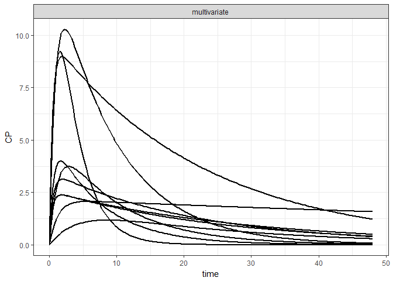
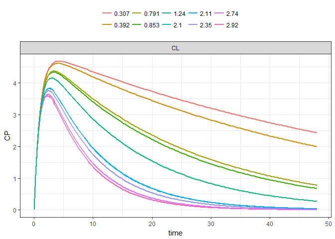
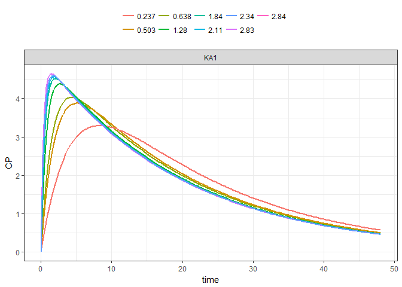
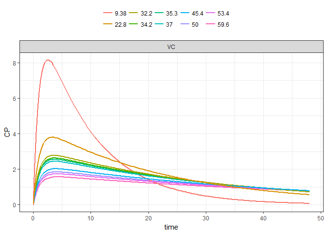
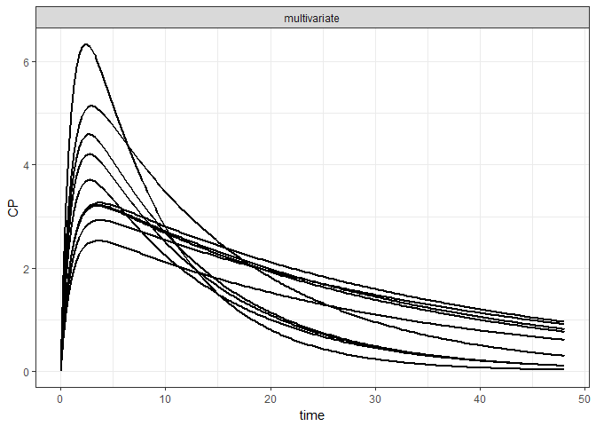
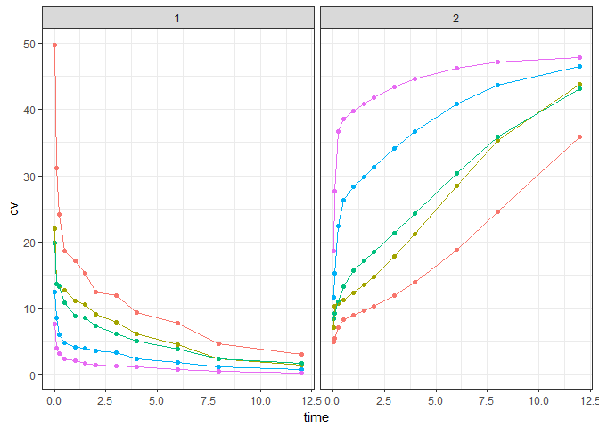

mrgsolvetk
==========

A toolkit to be used with `mrgsolve`

Installation
============

``` r
library(devtools)
install_github("mrgsolve/mrgsolvetk")
```

To install branch with `mrgoptim` function, until merged with mrgsolve/master:

``` r
library(devtools)
install_github("mhismail/mrgsolvetk",ref="mrgoptim")
```

Examples
========

``` r
library(ggplot2)
library(dplyr)
library(mrgsolve)
library(mrgsolvetk)

theme_set(theme_bw())

mod <- mread_cache("pk1cmt",modlib())

mod <- ev(mod, amt=100) %>% Req(CP) %>% update(end = 48, delta = 0.25)

param(mod)
```

    . 
    .  Model parameters (N=6):
    .  name value . name value
    .  CL   1     | KM   2    
    .  KA1  1     | VC   20   
    .  KA2  1     | VMAX 0

Sensitivity analyses
--------------------

### `sens_unif`

-   Draw parameters from uniform distribution based on current parameter values
-   `lower` and `upper` scale the parameter value to provide `a` and `b` arguments to `runif`

``` r
out <- 
  mod %>% 
  select(CL,VC,KA1) %>%
  sens_unif(.n=10, lower=0.2, upper=3)

out
```

    . # A tibble: 1,930 x 8
    .       ID  time    CP    CL    VC   KA1 name         value
    .    <dbl> <dbl> <dbl> <dbl> <dbl> <dbl> <chr>        <dbl>
    .  1    1. 0.     0.    2.26  10.0 0.548 multivariate    1.
    .  2    1. 0.250  1.24  2.26  10.0 0.548 multivariate    1.
    .  3    1. 0.500  2.26  2.26  10.0 0.548 multivariate    1.
    .  4    1. 0.750  3.08  2.26  10.0 0.548 multivariate    1.
    .  5    1. 1.00   3.74  2.26  10.0 0.548 multivariate    1.
    .  6    1. 1.25   4.25  2.26  10.0 0.548 multivariate    1.
    .  7    1. 1.50   4.64  2.26  10.0 0.548 multivariate    1.
    .  8    1. 1.75   4.93  2.26  10.0 0.548 multivariate    1.
    .  9    1. 2.00   5.14  2.26  10.0 0.548 multivariate    1.
    . 10    1. 2.25   5.27  2.26  10.0 0.548 multivariate    1.
    . # ... with 1,920 more rows

``` r
sens_plot(out, CP)
```



We can also make a univariate version of this

``` r
mod %>% 
  select(CL,VC,KA1) %>%
  sens_unif(.n=10, lower=0.2, upper=3, univariate = TRUE) %>%
  sens_plot(CP, split = TRUE)
```

    . $CL



    . 
    . $KA1



    . 
    . $VC



### `sens_norm`

-   Draw parameters from (log) normal distribution based on current parameter values and `%CV`

``` r
mod %>% 
  select(CL,VC) %>%
  sens_norm(.n=10, cv=30) %>%
  sens_plot(CP)
```



### `sens_seq`

-   Give a sequence for one or more parameters

``` r
mod %>% sens_seq(CL = seq(2,12,2), VC = seq(30,100,10)) %>% sens_plot(CP)
```


### `sens_range`

-   Create sets of parameters equally-spaced between two bounds

``` r
mod %>%
  select(CL,VC) %>%
  sens_range(.n = 5, .factor = 4) %>%
  sens_plot(CP, split = TRUE)
```

    . $CL


    . 
    . $VC


or

``` r
mod %>%
  sens_range(CL = c(0.5, 1.5), VC = c(10,40), .n = 5) %>%
  sens_plot(CP)
```


### `sens_grid`

-   Like `sens_seq` but performs all combinations

``` r
mod %>%  sens_grid(CL = seq(1,10,1), VC = seq(20,40,5)) %>% sens_plot(CP)
```


### `sens_covset`

-   Use `dmutate` to generate random variates for each parameter

``` r
cov1 <- dmutate::covset(CL ~ runif(1,3.5), VC[0,] ~ rnorm(50,25))

cov1
```

    .  Formulae                 
    .    CL ~ runif(1, 3.5)     
    .    VC[0, ] ~ rnorm(50, 25)

``` r
out <- mod %>% sens_covset(cov1) 
```

``` r
out
```

    . # A tibble: 19,300 x 7
    .       ID  time    CP    CL    VC name         value
    .    <dbl> <dbl> <dbl> <dbl> <dbl> <chr>        <dbl>
    .  1    1. 0.     0.    2.89  15.8 multivariate    1.
    .  2    1. 0.250  1.37  2.89  15.8 multivariate    1.
    .  3    1. 0.500  2.38  2.89  15.8 multivariate    1.
    .  4    1. 0.750  3.10  2.89  15.8 multivariate    1.
    .  5    1. 1.00   3.61  2.89  15.8 multivariate    1.
    .  6    1. 1.25   3.95  2.89  15.8 multivariate    1.
    .  7    1. 1.50   4.17  2.89  15.8 multivariate    1.
    .  8    1. 1.75   4.29  2.89  15.8 multivariate    1.
    .  9    1. 2.00   4.33  2.89  15.8 multivariate    1.
    . 10    1. 2.25   4.32  2.89  15.8 multivariate    1.
    . # ... with 19,290 more rows

``` r
distinct(out,ID,CL,VC)
```

    . # A tibble: 100 x 3
    .       ID    CL    VC
    .    <dbl> <dbl> <dbl>
    .  1    1.  2.89  15.8
    .  2    2.  2.54  65.0
    .  3    3.  2.12  22.2
    .  4    4.  1.87  63.1
    .  5    5.  3.28  59.3
    .  6    6.  3.18  32.4
    .  7    7.  2.85  78.8
    .  8    8.  2.17  34.3
    .  9    9.  2.98  23.4
    . 10   10.  1.50  62.2
    . # ... with 90 more rows

Maximum Likelihood Parameter Optimization
-----------------------------------------

### `mrgoptim`

This example shows a simultaneous fit of PK and PD data from five dose levels.

#### Data structure

The data to be fit is an mrgsolve dataset. Required columns for fitting are:

-   ID
-   time
-   evid
-   cmt
-   amt
-   dv

``` r
data <-  read.csv("inst/maintenance/data/optim-example.csv")

head(data)
```

    .   ID time cmt evid       dv  amt
    . 1  1 0.00   1    1       NA 1000
    . 2  1 0.04   1    0 49.73123   NA
    . 3  1 0.04   2    0  4.91075   NA
    . 4  1 0.10   1    0 31.21634   NA
    . 5  1 0.10   2    0  5.49637   NA
    . 6  1 0.25   1    0 24.10030   NA

Plot the data to get an idea of the profiles to be fit. cmt 1 is plasma concentration data and cmt 2 is PD data

``` r
ggplot(data,aes(x=time,y=dv,color=as.factor(ID)))+
  geom_point()+
  geom_line()+
  facet_wrap("cmt")+
  guides(color=F)
```



The following model will be fit to these data:

-   PK: 2 compartment model
-   PD: Emax model with baseline
-   Proportional error models for both PK and PD

``` r
code<-"
$PROB 2 cmt PK Model, Emac PD model

$PARAM
CL=10
VC = 20
VP = 20
Q=20
Emax = 60
BL = 50
EC50 = 10
gamma =1
sigma1 = 0.1
sigma2 = 0.1

$CMT X1 X2 

$ODE
dxdt_X1 = -(Q+CL)/VC*X1+Q/VP*X2;
dxdt_X2 = Q/VC*X1-Q/VP*X2;

$TABLE
double PK = X1/VC;
double varPK = (PK*sigma1)*(PK*sigma1);


double PD = BL-(pow(PK,gamma)*Emax)/(pow(PK,gamma)+pow(EC50,gamma));
double varPD = (PD*sigma2)*(PD*sigma2);


$CAPTURE PK varPK PD varPD"

mod <- mcode("2cmtPK-Emax",code)
```

Here, the plasma concentrations, response, and variances were captured in the **PK**, **PD**, **varPK**, and **varPD** outputs, respectively.

Let's check how the initial parameter values fit the data.

``` r
out <- mod%>%
  data_set(data)%>%
  obsonly()%>%
  mrgsim()%>%
  as.data.frame()

ggplot(out,aes(x=time,y=PK,color=as.factor(ID)))+
  geom_line()+
  geom_point(data=filter(data,cmt==1),aes(y=dv))+
  guides(color=F)
```


``` r
ggplot(out,aes(x=time,y=PD,color=as.factor(ID)))+
  geom_line()+
  geom_point(data=filter(data,cmt==2),aes(y=dv))+
  guides(color=F)
```


Not terrible, should be good enough for initial estimates.

Now let's use `mrgoptim` to optimize the parameters and return parameter values and precision. The `input`, `output`,and `var` arguments map the observed values to the output compartments and variances of the outputs. Since compartment `1` in the input dataset corresponds to plasma concentration data, which is the `PK` column in the output, they both need to be the first value in their respective vectors. Similarly, since `varPK` corresponds to the variance of the `PK` data, it is the first value in the `var` argument vector.

``` r
fit<- mod%>%
  data_set(data)%>%
  mrgoptim(input=c(1,2),
           output=c("PK","PD"),
           var= c("varPK","varPD"),
           prms=c("CL",
             "VC",
             "VP",
             "Q",
             "Emax",
             "BL",
             "EC50",
             "gamma"),
           v_prms=c("sigma1","sigma2"),
           method="newuoa")
```

The function returns a list with some information about the optimization, the final objective function value (-2LL), final parameter estimates, covariance and correlation matrices, CV percent, and output dataset.

``` r
print(fit)
```

    . $par
    .           CL           VC           VP            Q         Emax 
    .   8.75327427  16.75435032  31.23347609 107.29599243  42.94647482 
    .           BL         EC50        gamma       sigma1       sigma2 
    .  48.39405826   4.34352755   1.69943185   0.15710800   0.08946297 
    . 
    . $fval
    . [1] 194.7883
    . 
    . $feval
    . [1] 4409
    . 
    . $ierr
    . [1] 0
    . 
    . $msg
    . [1] "Normal exit from newuoa"
    . 
    . $cov
    .                [,1]          [,2]          [,3]          [,4]
    .  [1,]  4.043721e-02  3.311258e-02  6.335102e-02  2.399507e-01
    .  [2,]  3.311258e-02  1.860699e+00 -1.312738e+00 -1.086120e+01
    .  [3,]  6.335102e-02 -1.312738e+00  2.724424e+00  9.639859e+00
    .  [4,]  2.399507e-01 -1.086120e+01  9.639859e+00  1.562499e+02
    .  [5,] -2.076929e-03  1.666688e-01 -2.382385e-01  2.468680e-02
    .  [6,] -2.350953e-03  1.125617e-01 -1.277180e-01 -2.753444e-01
    .  [7,] -1.542188e-02 -3.406593e-02 -6.287605e-02 -4.745000e-02
    .  [8,] -1.395761e-03 -6.227778e-03  2.532221e-02  6.461238e-03
    .  [9,]  5.657381e-04  1.082859e-03  2.018669e-03  6.934685e-03
    . [10,] -1.234537e-10 -9.167124e-10  1.389181e-09  4.591574e-09
    .                [,5]          [,6]          [,7]          [,8]
    .  [1,] -2.076929e-03 -2.350953e-03 -1.542188e-02 -1.395761e-03
    .  [2,]  1.666688e-01  1.125617e-01 -3.406593e-02 -6.227778e-03
    .  [3,] -2.382385e-01 -1.277180e-01 -6.287605e-02  2.532221e-02
    .  [4,]  2.468680e-02 -2.753444e-01 -4.745000e-02  6.461238e-03
    .  [5,]  5.100065e+00  4.397875e+00 -5.618285e-01 -2.377599e-01
    .  [6,]  4.397875e+00  3.942670e+00 -5.206639e-01 -1.868286e-01
    .  [7,] -5.618285e-01 -5.206639e-01  9.179409e-02  2.616588e-02
    .  [8,] -2.377599e-01 -1.868286e-01  2.616588e-02  1.642798e-02
    .  [9,] -1.587743e-09 -7.916715e-10 -2.807287e-04  2.965716e-10
    . [10,] -5.125293e-04 -5.775370e-04  1.786404e-09  9.453311e-10
    .                [,9]         [,10]
    .  [1,]  5.657381e-04 -1.234537e-10
    .  [2,]  1.082859e-03 -9.167125e-10
    .  [3,]  2.018669e-03  1.389181e-09
    .  [4,]  6.934685e-03  4.591576e-09
    .  [5,] -1.587743e-09 -5.125293e-04
    .  [6,] -7.916714e-10 -5.775370e-04
    .  [7,] -2.807287e-04  1.786404e-09
    .  [8,]  2.965716e-10  9.453311e-10
    .  [9,]  2.158452e-04 -1.052908e-12
    . [10,] -1.052908e-12  6.776449e-05
    . 
    . $cor
    .                [,1]          [,2]          [,3]          [,4]
    .  [1,]  1.000000e+00  1.207159e-01  1.908647e-01  9.546002e-02
    .  [2,]  1.207159e-01  1.000000e+00 -5.830460e-01 -6.369861e-01
    .  [3,]  1.908647e-01 -5.830460e-01  1.000000e+00  4.672222e-01
    .  [4,]  9.546002e-02 -6.369861e-01  4.672222e-01  1.000000e+00
    .  [5,] -4.573442e-03  5.410389e-02 -6.391264e-02  8.745147e-04
    .  [6,] -5.887870e-03  4.155826e-02 -3.896902e-02 -1.109357e-02
    .  [7,] -2.531275e-01 -8.242801e-02 -1.257305e-01 -1.252907e-02
    .  [8,] -5.415372e-02 -3.562074e-02  1.196939e-01  4.032866e-03
    .  [9,]  1.914933e-01  5.403346e-02  8.324470e-02  3.776119e-02
    . [10,] -7.457826e-08 -8.163830e-08  1.022399e-07  4.462217e-08
    .                [,5]          [,6]          [,7]          [,8]
    .  [1,] -4.573442e-03 -5.887870e-03 -2.531275e-01 -5.415372e-02
    .  [2,]  5.410389e-02  4.155826e-02 -8.242801e-02 -3.562074e-02
    .  [3,] -6.391264e-02 -3.896902e-02 -1.257305e-01  1.196939e-01
    .  [4,]  8.745147e-04 -1.109357e-02 -1.252907e-02  4.032866e-03
    .  [5,]  1.000000e+00  9.807535e-01 -8.211236e-01 -8.214075e-01
    .  [6,]  9.807535e-01  1.000000e+00 -8.654757e-01 -7.341014e-01
    .  [7,] -8.211236e-01 -8.654757e-01  1.000000e+00  6.738076e-01
    .  [8,] -8.214075e-01 -7.341014e-01  6.738076e-01  1.000000e+00
    .  [9,] -4.785433e-08 -2.713805e-08 -6.306787e-02  1.574948e-07
    . [10,] -2.756956e-02 -3.533324e-02  7.162610e-07  8.959643e-07
    .                [,9]         [,10]
    .  [1,]  1.914933e-01 -7.457826e-08
    .  [2,]  5.403346e-02 -8.163831e-08
    .  [3,]  8.324470e-02  1.022399e-07
    .  [4,]  3.776119e-02  4.462219e-08
    .  [5,] -4.785432e-08 -2.756956e-02
    .  [6,] -2.713804e-08 -3.533324e-02
    .  [7,] -6.306787e-02  7.162610e-07
    .  [8,]  1.574948e-07  8.959643e-07
    .  [9,]  1.000000e+00 -8.705992e-09
    . [10,] -8.705993e-09  1.000000e+00
    . 
    . $CVPercent
    .        CL        VC        VP         Q      Emax        BL      EC50 
    .  2.297312  8.141613  5.284660 11.650011  5.258481  4.103016  6.975331 
    .     gamma    sigma1    sigma2 
    .  7.542032  9.351320  9.201482 
    . 
    . $fitted_data
    .     ID  time cmt         dv       pred          var
    . 1    1  0.04   1 49.7312300 46.0796230 52.410030270
    . 2    1  0.04   2  4.9107500  6.2098379  0.308636401
    . 3    1  0.10   1 31.2163430 33.6300850 27.915956158
    . 4    1  0.10   2  5.4963700  6.7332477  0.362857247
    . 5    1  0.25   1 24.1003020 21.7506825 11.677297743
    . 6    1  0.25   2  7.0547400  8.0580543  0.519693147
    . 7    1  0.50   1 18.6064240 18.0421607  8.034774056
    . 8    1  0.50   2  8.2386300  8.9544988  0.641754880
    . 9    1  1.00   1 17.2169040 16.2957899  6.554618366
    . 10   1  1.00   2  8.9477600  9.5535494  0.730493100
    . 11   1  1.50   1 15.3247450 14.9201327  5.494674187
    . 12   1  1.50   2  9.5888900 10.1448554  0.823717577
    . 13   1  2.00   1 12.4596430 13.6618611  4.606979811
    . 14   1  2.00   2 10.2978000 10.8088276  0.935069287
    . 15   1  3.00   1 11.9853760 11.4547276  3.238665595
    . 16   1  3.00   2 11.9391000 12.3784604  1.226365360
    . 17   1  4.00   1  9.3736800  9.6041662  2.276752977
    . 18   1  4.00   2 13.8959000 14.2994110  1.636526017
    . 19   1  6.00   1  7.7204113  6.7516429  1.125163178
    . 20   1  6.00   2 18.7456000 19.2293043  2.959468740
    . 21   1  8.00   1  4.6017323  4.7463446  0.556051617
    . 22   1  8.00   2 24.5406000 25.3056635  5.125332814
    . 23   1 12.00   1  3.0028117  2.3456265  0.135804547
    . 24   1 12.00   2 35.9189000 37.2371412 11.097860917
    . 25   2  0.04   1 22.0138820 34.5597172 29.480642037
    . 26   2  0.04   2  7.0795900  6.6766960  0.356787660
    . 27   2  0.10   1 13.6405360 25.2225638 15.702725342
    . 28   2  0.10   2 10.3125000  7.5050434  0.450809465
    . 29   2  0.25   1 13.2921580 16.3130119  6.568479980
    . 30   2  0.25   2 10.7249000  9.5468884  0.729474817
    . 31   2  0.50   1 12.7862020 13.5316205  4.519560406
    . 32   2  0.50   2 11.2202000 10.8856742  0.948412520
    . 33   2  1.00   1 11.0903130 12.2218424  3.686972831
    . 34   2  1.00   2 12.2981000 11.7617940  1.107219567
    . 35   2  1.50   1 10.5310550 11.1900995  3.090754230
    . 36   2  1.50   2 13.4954000 12.6124491  1.273167265
    . 37   2  2.00   1  9.1342760 10.2463958  2.591426144
    . 38   2  2.00   2 14.8131000 13.5513230  1.469772125
    . 39   2  3.00   1  7.9227580  8.5910457  1.821749396
    . 40   2  3.00   2 17.7958000 15.7047635  1.974010294
    . 41   2  4.00   1  6.1166954  7.2031247  1.280673551
    . 42   2  4.00   2 21.1754000 18.2206667  2.657144302
    . 43   2  6.00   1  4.5425880  5.0637322  0.632904287
    . 44   2  6.00   2 28.5158000 24.1373011  4.662985117
    . 45   2  8.00   1  2.4414084  3.5597584  0.312779035
    . 46   2  8.00   2 35.3294000 30.5174857  7.453909473
    . 47   2 12.00   1  1.3998046  1.7592199  0.076390058
    . 48   2 12.00   2 43.8288000 40.7873245 13.314873683
    . 49   3  0.04   1 19.8496480 23.0398115 13.102507543
    . 50   3  0.04   2  8.4846800  7.8282059  0.490468473
    . 51   3  0.10   1 13.6405360 16.8150426  6.978989091
    . 52   3  0.10   2  9.2260800  9.3598235  0.701167750
    . 53   3  0.25   1 13.2921580 10.8753413  2.919324468
    . 54   3  0.25   2 10.9996000 12.9065894  1.333243891
    . 55   3  0.50   1 10.8070680  9.0210803  2.008693516
    . 56   3  0.50   2 13.2726000 15.0708067  1.817856570
    . 57   3  1.00   1  8.7865870  8.1478950  1.638654591
    . 58   3  1.00   2 15.6679000 16.4238728  2.158926011
    . 59   3  1.50   1  8.5621790  7.4600663  1.373668548
    . 60   3  1.50   2 17.1228000 17.6926585  2.505375366
    . 61   3  2.00   1  7.3310900  6.8309306  1.151744953
    . 62   3  2.00   2 18.4746000 19.0442746  2.902789086
    . 63   3  3.00   1  6.1963344  5.7273638  0.809666401
    . 64   3  3.00   2 21.3042000 21.9653999  3.861578272
    . 65   3  4.00   1  5.1034656  4.8020831  0.569188244
    . 66   3  4.00   2 24.3006000 25.0940090  5.039955619
    . 67   3  6.00   1  3.7901090  3.3758216  0.281290808
    . 68   3  6.00   2 30.3706000 31.4506803  7.916745824
    . 69   3  8.00   1  2.3484780  2.3731723  0.139012909
    . 70   3  8.00   2 35.8188000 37.0725055 10.999944379
    . 71   3 12.00   1  1.6561556  1.1728133  0.033951138
    . 72   3 12.00   2 43.0923000 44.2057121 15.640239394
    . 73   4  0.04   1 12.4596430 11.5199057  3.275626886
    . 74   4  0.04   2 11.5892000 12.3225979  1.215321454
    . 75   4  0.10   1  8.5621790  8.4075213  1.744747273
    . 76   4  0.10   2 15.2531000 15.9940121  2.047394122
    . 77   4  0.25   1  6.0380800  5.4376706  0.729831117
    . 78   4  0.25   2 22.4137000 22.8706491  4.186427708
    . 79   4  0.50   1  4.8461100  4.5105402  0.502173379
    . 80   4  0.50   2 26.3215000 26.2326275  5.507698997
    . 81   4  1.00   1  4.1493260  4.0739475  0.409663648
    . 82   4  1.00   2 28.2763000 28.0887781  6.314693972
    . 83   4  1.50   1  3.9400852  3.7300332  0.343417137
    . 84   4  1.50   2 29.8210000 29.6837561  7.052195159
    . 85   4  2.00   1  3.6458411  3.4154653  0.287936238
    . 86   4  2.00   2 31.3240000 31.2467160  7.814395257
    . 87   4  3.00   1  3.2874105  2.8636819  0.202416600
    . 88   4  3.00   2 34.1655000 34.2194611  9.372014367
    . 89   4  4.00   1  2.4100301  2.4010416  0.142297061
    . 90   4  4.00   2 36.7227000 36.9063186 10.901545348
    . 91   4  6.00   1  1.7898185  1.6879107  0.070322698
    . 92   4  6.00   2 40.8320000 41.2175461 13.597243572
    . 93   4  8.00   1  1.2141426  1.1865861  0.034753226
    . 94   4  8.00   2 43.6434000 44.1301148 15.586791553
    . 95   4 12.00   1  0.7236866  0.5864066  0.008487784
    . 96   4 12.00   2 46.5103000 47.0110907 17.688347794
    . 97   5  0.04   1  7.6211843  5.7599529  0.818906721
    . 98   5  0.04   2 18.7133000 21.8674955  3.827231265
    . 99   5  0.10   1  3.9913847  4.2037606  0.436186818
    . 100  5  0.10   2 27.7209000 27.5174496  6.060423503
    . 101  5  0.25   1  3.1622777  2.7188353  0.182457779
    . 102  5  0.25   2 36.7104000 35.0442094  9.829222052
    . 103  5  0.50   1  2.3790550  2.2552701  0.125543345
    . 104  5  0.50   2 38.5164000 37.7795661 11.423535725
    . 105  5  1.00   1  2.0903776  2.0369737  0.102415912
    . 106  5  1.00   2 39.7587000 39.1009969 12.236642529
    . 107  5  1.50   1  1.7668147  1.8650166  0.085854284
    . 108  5  1.50   2 40.8483000 40.1460807 12.899501307
    . 109  5  2.00   1  1.4741421  1.7077326  0.071984060
    . 110  5  2.00   2 41.8187000 41.0981664 13.518593424
    . 111  5  3.00   1  1.3121320  1.4318409  0.050604150
    . 112  5  3.00   2 43.4296000 42.7374807 14.618555117
    . 113  5  4.00   1  1.1090313  1.2005208  0.035574265
    . 114  5  4.00   2 44.6577000 44.0533055 15.532580588
    . 115  5  6.00   1  0.7720411  0.8439554  0.017580675
    . 116  5  6.00   2 46.2530000 45.8953826 16.858720228
    . 117  5  8.00   1  0.4484204  0.5932931  0.008688307
    . 118  5  8.00   2 47.1037000 46.9842871 17.668183284
    . 119  5 12.00   1  0.2379055  0.2932033  0.002121946
    . 120  5 12.00   2 47.7698000 47.9585258 18.408494089

Lets check how the optimized parameters fit the data.

``` r
out_fit <- mod%>%
  param(fit$par)%>%
  data_set(data)%>%
  obsonly()%>%
  mrgsim()%>%
  as.data.frame()


ggplot(out_fit,aes(x=time,y=PK,color=as.factor(ID)))+
  geom_line()+
  geom_point(data=filter(data,cmt==1),aes(y=dv))+
  guides(color=F)
```


``` r
ggplot(out_fit,aes(x=time,y=PD,color=as.factor(ID)))+
  geom_line()+
  geom_point(data=filter(data,cmt==2),aes(y=dv))+
  guides(color=F)
```


